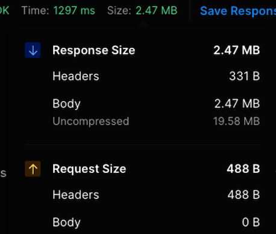
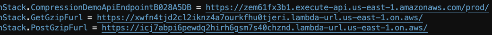
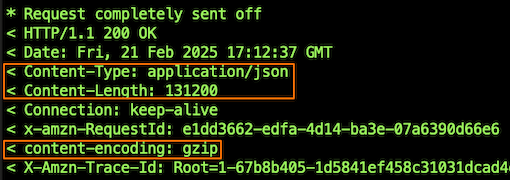
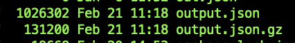

# Using data compression with AWS Lambda functions

This sample illustrates using data compression with API Gateway and Lambda functions to 
1. Receive and return payloads larger than the maximum Lambda's payload size of 6MB
2. Potentially save on data transfer costs when using Lambda functions with NAT Gateway or VPC Endpoints

While discussed in context of API Gateway and Lambda, the same compression technique can be applied to other serverless usecases as well, such as transporting larger payloads in SQS queue messages or EventBridge events. 

> Important: this sample uses various AWS services and there are costs associated with these services after the Free Tier usage - please see the [AWS Pricing page](https://aws.amazon.com/pricing/) for details. You are fully responsible for any AWS costs incurred. This sample is provided for educational purposes only. 

## Overview

The Lambda Invoke API supports requests and responses in uncompressed plain-text formats, such as JSON. The payload size for both request and response is limited to 6MB. 

While the Invoke API supports uncompressed text-based payloads, you can easily introduce data compression in your function code. In case you're invoking the function directly via the Invoke API or AWS SDK – you’ll need to handle compression and decompression on both server and client side. If you're invoking functions via API Gateway or Function URLs, these services can handle the compression automatically for you, as shown in this sample. 

Below results are obtained using Postman. 20MB of JSON is returned from Lambda function as a 2.5MB compressed payload. 



## Reducing payload sizes

In this sample project, a 1MB JSON payload is received by and returned from a Lambda handler. The sample uses in-function compression, and illustrates how you can pass compressed payloads through Function URLs and API Gateway. You can use clients such as curl or Postman to test this functionality. This approach can help you to send and receive payloads larger than Lambda's limit of 6MB, as long as they're less than 6MB when compressed. 

## Deployment Instructions

### Pre-reqs

* [An AWS account](https://portal.aws.amazon.com/gp/aws/developer/registration/index.html) 
* [AWS CLI](https://docs.aws.amazon.com/cli/latest/userguide/install-cliv2.html) 
* [Git](https://git-scm.com/book/en/v2/Getting-Started-Installing-Git)
* [AWS Cloud Development Kit](https://aws.amazon.com/cdk/)

### Installation steps

1. Create a new directory, navigate to that directory in a terminal and clone the GitHub repository:
    ``` 
    git clone https://github.com/aws-samples/lambda-with-compression
    ```
1. Change directory to the pattern directory:
    ```
    cd lambda-with-compression
    ```
2. From the command line, use AWS CDK to deploy the AWS resources for the pattern:
    ```
    cdk deploy
    ```
3. Allow CDK CLI to create IAM roles with the required permissions.

4. Note the output from the CDK deployment process. It contain function URLs and API Gateway andpoint you can use for testing. This sample stack enforces IAM authentication for Function URL for better security. You will either need to use your AWS credentials to invoke the generated Function URL, or change the authentication type to `FunctionUrlAuthType.NONE` in `stack/functions.js`.



## Testing

Use curl, Postman, or similar HTTP client to invoke Function URLs or API Gateway endpoints. 

#### Sending GET requets with curl

The following command will retrieve 1MB of JSON compressed to approximately 125KB. You'll need to use either the `ApiEndpoint` or `GetGzipFurl` from the CDK output. 

```bash
curl $ApiGatewayEndpoint -v >output.json.gz
```

> When using Function URLs with IAM authorization enabled, you need to add authentication information with `--user $AWS_ACCESS_KEY_ID:$AWS_SECRET_ACCESS_KEY
    --aws-sigv4 'aws:amz:us-east-1:lambda'`

Note the `Content-Type`, `Content-Encoding`, and `Content-Length` headers



Use `gzip` command to decompress received data 

```bash
gzip -dk output.json.gz
```

Note that the resulting output is 1MB in size, while received compressed payload is ~130KB. 



You can use similar technique to POST compressed data to either API Gateway endpont or `PostGzipFurl` in a POST request. Note that you'll need to set `Content-Type=application/gzip` HTTP header. 

```bash
curl -X POST -v https://zem61fx3b1.execute-api.us-east-1.amazonaws.com/prod/ \
    -H "Content-Type: application/gzip" \
    --data-binary "@output.json.gz"
```

And see the response illustrating compression was used


Note that ~130KB of gzip data becomes ~175KB when Base64 encoded. 

## Reducing network footprint

It is common for cloud solutions residing in a VPC to invoke Lambda functions. For example an EKS-based control plane needs to invoke a series of Lambda functions. This is usually achieved through either NAT Gateway or VPC Endpoint. 

Both NAT Gateway and VPC Endpoint are priced per GB of data processed, so reducing the volume of data by using compression can also reduce the data transfer cost. However, on the other hand, compressing/decompressing data is a CPU-intensive activity, which can require additional compute capacity and increase function invocation duration, and as a result function cost. Below results illustrate a series of tests ran to estimate the impact of data compression of Lambda function invocation duration, Lambda function invocation cost, and data transfer costs delta with both NAT Gateway and VPC Endpoint. 

> Below tests were performed with a series of assumptions and randomly generated JSON data. You should always perform your own performance/cost estimates with representative payloads. Different payloads will have different compression ratios. Payloads with low compression ratios might not benefit from this technique.

## Assumptions

* Lambda cost (GB-s, ARM/Graviton2) - $0.000013 [(pricing)](https://aws.amazon.com/lambda/pricing/)
* NAT Gateway cost (per GB) - $0.045 [(pricing)](https://aws.amazon.com/vpc/pricing/)
* VPC Endpoint cost (per GB) - $0.010 [(pricing)](https://aws.amazon.com/privatelink/pricing/).
* Tested with different randomly generated JSON payload sizes - 10KB, 100KB, 1MB, 5MB
* Tested with different function memory configurations - 512MB, 1GB, 2GB (more allocated memory results in more allocated CPU capacity [(docs)](https://docs.aws.amazon.com/lambda/latest/dg/configuration-memory.html)). 
* Estimate cost deltas for processing 1,000,000 requests
* Use gzip for data compression 

## Testing results

### Added duration - invocation duration delta (ms) (compressed vs uncompressed)

Compressing data is a CPU intensive activity, and as such it adds function invocation duration. The following chart illustrates the added duration in milliseconds when compressing JSON objects of various sizes with various memory allocations. E.g. compressing a 1MB JSON object with function  configured with 1GB of allocated memory took on average 124ms.

|       | 512MB | 1GB | 2GB |
| ----- | ----: | --: | --: |
| 10KB  | 1     | 1   | 1   |
| 100KB | 27    | 13  | 9   |
| 1MB   | 251   | 124 | 70  |
| 5MB   | 1210  | 588 | 342 |

### Added cost - invocation duration delta cost (compressed vs uncompressed)

The following chart illustrates the calculated estimate for added cost of compressing data. Continuing the example from previous chart - 1,000,000 invocations * 124ms of added duration per invocation * 1GB of allocated memory would result in 124,000 GB-seconds. 124,000 GB-seconds at $0.000013 per GB-second would cost $1.65.

|       | 512MB | 1GB   | 2GB   |
| ----- | ----: | ----: | ----: |
| 10KB  | $0.01 | $0.01 | $0.03 |
| 100KB | $0.18 | $0.17 | $0.24 |
| 1MB   | $1.67 | $1.65 | $1.87 |
| 5MB   | $8.07 | $7.84 | $8.64 |

### Savings - data transfer delta cost (compressed vs uncompressed)

Compressed data is commonly represented as a binary stream/buffer. Lambda requires binary data to be encoded as base64 prior to returning via API Gateway / Function URLs. For brevety, the term "compression" below implies gzipping and subsequently base64-encoding the data. 

Mean compression ratio of randomly generated JSON objects was ~10-to-3, i.e. 1MB of JSON data produced a 300KB string after gzipping and base64-encoding, yielding ~70% space saving. 

The following chart illustrates estimated savings, or cost delta for sending uncompressed data vs compressed through NAT Gateway and VPC Endpoint. E.g. 
* Sending 1MB concompressed payload for 1,000,000 times would result in sending 1000GB total
* Compressing the same 1MB payload to 300KB and sending it for 1,000,000 times would result in sending 300GB total
* By compressing data you can reduce total network footprint by 700MB
* When transported through NAT Gateway, 700GB * $0.045 per GB would cost $31.50

|       | NAT Gateway | VPC Endpoint (1 AZ) |
| ----- | ----------: | -----------: |
| 10KB  | $0.32       | $0.07        |
| 100KB | $3.15       | $0.70        |
| 1MB   | $31.50      | $7.00        |
| 5MB   | $157.50     | $35.00       |

### Conclusion

In all test cases the savings from sending compressed data via NAT Gateway or VPC Endpoint were higher than the added cost of compressing data in Lambda. The data compression technique can be applied as an efficient cost savings mechanism if you can tolerate added latency, especially at a large scale of millions/billions of invocations. Additionally, the compression technique can be applied for sending and receiving payloads with sizes larger than the maximum payload limits. 

> Above tests were performed with a series of assumptions and randomly generated JSON data. You should ALWAYS perform your own performance/cost estimates with representative payloads. Different payloads will have different compression ratios. Payloads with low compression ratios might not benefit from this technique.

## Notes

* Using other compression methods, such as [zstd](https://facebook.github.io/zstd/), may yield different results
* For functions configured with >2GB of RAM it is important to use compression method that supports multiple vCPUs for maximum efficiency. 
* While this experiment focused on AWS Lambda, the same technique can be applied to any other service, e.g. reducing message sizes of large messages flowing through Amazon SQS. 

## Cleanup
 
Delete the stack

```bash
cdk destroy
```
----
Copyright 2023 Amazon.com, Inc. or its affiliates. All Rights Reserved.

SPDX-License-Identifier: MIT-0